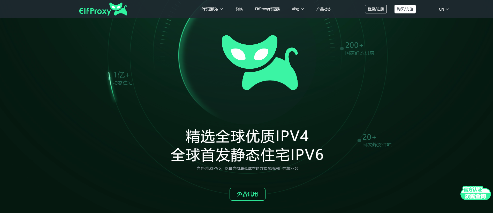

<p align="center">
  
</p>
<h1 align="center" style="border-bottom: none;">
  ElfProxy MCP Server
</h1>
<p align="center">
  <p align="center">Extract agent seamlessly with ElfProxy via the Model Context Protocol</p>
</p>

[](http://pyrn.2.vu/1)
[](http://pyrn.2.vu/1)

<br/>

## 📖 Overview

A privacy-first infrastructure solution combining dynamic IP rotation with AI-optimized web interaction capabilities. This integration enables secure, large-scale web data access for AI systems through two synergistic components:

**1. ElfProxy Dynamic IP Network**  
Global residential proxy infrastructure featuring:
- 🌐 195+ country IP pools with city-level targeting
- 🔄 Automatic IP rotation (1s-24h adjustable intervals)
- 🛡️ Built-in TLS fingerprint masking
- ⚡ Multi-protocol support (HTTP/SOCKS5/WebSocket)
- 📊 Real-time traffic analytics dashboard

**2. Enhanced Model Context Protocol (MCP)**  
AI-specific web interaction layer with:
- 🧠 Context-aware request scheduling
- 🖥️ Headless browser rendering cluster
- ✂️ Intelligent content sanitization (Ads/Trackers/Boilerplate removal)
- 🔄 3-stage failover system (IP/Header/Protocol rotation)
- ⏱️ Adaptive rate limiting (Requests/second auto-tuning)

### Key Features
| Category              | Capabilities                                                                 |
|-----------------------|-----------------------------------------------------------------------------|
| **Anonymity**         | IP/UserAgent/Canvas fingerprint rotation                                   |
| **AI Optimization**   | Content extraction → Markdown/JSON/Plaintext conversion                    |
| **Geo-Targeting**     | Country/City/ASN-level location simulation                                 |
| **Security**          | End-to-end HTTPS encryption + Request timestamp obfuscation                |
| **Reliability**       | 99.99% SLA with automatic proxy blacklisting                              |

## 💡 Example Queries
When you've set up the MCP server with **Claude**, you can make requests like:

- Please extract a proxy IP address from the United States for me
- Accessing through a US proxy IP using `puppeteer`  ` https://www.amazon.de `

## ✅ Prerequisites

Before you begin, make sure you have:

- **ElfProxy Account**: Please register an account in [ElfProxy](http://pyrn.2.vu/1/) first, contact ElfProxy customers, and obtain an apiKey (there will be 200MB of data available for trial use)

### 🧩 Server Configuration

The apiKey can be configured using the `application.yml` system property. 

### Cursor Tool Configuration

To use this MCP server in Cursor, add the following configuration to your Cursor settings:

```json
{
  "proxy-pool-server": {
    "url": "http://localhost:9000/sse",
    "enabled": true
  }
}
```

## Building

```bash
mvn clean package
```

## Running

```bash
java -jar target/proxy-pool-server-{version}.jar
```

## API Endpoints

The server exposes the following MCP tools:

- `getProxy`:Retrieve an IP address from the proxy pool and use the 'code' field to tell me which country's code you need. I will extract the IP address from the code and provide it to you


## License

This project is licensed under the [MIT License](LICENSE).

## About ElfProxy

With over 100M IP nodes and global service coverage (excluding China), we provide service support for multiple million level products with stable and reliable IP quality. Our comprehensive services are trustworthy

[](http://pyrn.2.vu/1/)
